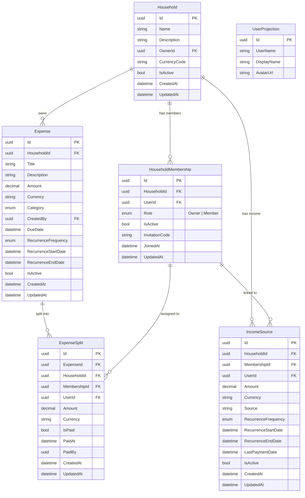

# Domain Model — Finance

## ERD

## Aggregates & Invariants

### Household
| Invariant | Where enforced |
|---|---|
| Name cannot be empty | `Household.Create` / `Update` |
| Only owner can transfer ownership | `HouseholdWorkflowManager.TransferOwnershipAsync` |
| New owner must be an active member | `HouseholdWorkflowManager.TransferOwnershipAsync` |
| Only owner can delete | `HouseholdWorkflowManager.DeleteAsync` |
| Cannot delete with >1 active member | `HouseholdWorkflowManager.DeleteAsync` |
| Cannot deactivate already inactive | `Household.Deactivate` |

### HouseholdMembership
| Invariant | Where enforced |
|---|---|
| Cannot change role to current role | `HouseholdMembership.ChangeRole` |
| Cannot remove already inactive membership | `HouseholdMembership.Remove` |
| AcceptInvitation requires inactive membership with code | `HouseholdMembership.AcceptInvitation` |

### Expense
| Invariant | Where enforced |
|---|---|
| Title cannot be empty | `Expense.Create` / `Update` |
| Amount cannot be negative | `Expense.Create` / `Update` |
| Due date cannot be in the past | `Expense.Create` |
| Cannot deactivate already inactive expense | `Expense.Deactivate` |

### ExpenseSplit
| Invariant | Where enforced |
|---|---|
| Amount cannot be negative | `ExpenseSplit.Create` / `Update` |
| Cannot pay already paid split | `ExpenseSplit.Pay` |
| One split per member per expense | `ExpenseWorkflowManager.UpsertSplitAsync` |

### IncomeSource
| Invariant | Where enforced |
|---|---|
| Source label cannot be empty | `IncomeSource.Create` / `Update` |
| Amount cannot be negative | `IncomeSource.Create` / `Update` |
| `TryDeactivate` is idempotent (no throw) | `IncomeSource.TryDeactivate` |
| `Deactivate` throws if already inactive | `IncomeSource.Deactivate` |

## Value Objects

| Type | Description |
|---|---|
| `Money` | Amount + currency code |
| `RecurrenceSchedule` | Frequency + start date + optional end date |
| `HouseholdRole` | `Owner`, `Member` |
| `ExpenseCategory` | Enum of expense categories |
| `RecurrenceFrequency` | `Daily`, `Weekly`, `Monthly`, `Yearly` |

## Domain Events

| Event | Raised by |
|---|---|
| `HouseholdCreated` | `Household.Create` |
| `HouseholdUpdated` | `Household.Update` |
| `HouseholdOwnershipTransferred` | `Household.TransferOwnership` |
| `HouseholdDeleted` | `Household.Deactivate` |
| `HouseholdMemberJoined` | `HouseholdMembership.Create` / `AcceptInvitation` |
| `HouseholdMemberInvited` | `HouseholdMembership.CreateWithInvitation` |
| `HouseholdMemberRoleChanged` | `HouseholdMembership.ChangeRole` |
| `HouseholdMemberRemoved` | `HouseholdMembership.Remove` |
| `ExpenseCreated` | `Expense.Create` |
| `ExpenseUpdated` | `Expense.Update` |
| `ExpenseDeactivated` | `Expense.Deactivate` |
| `ExpenseSplitCreated` | `ExpenseSplit.Create` |
| `ExpenseSplitUpdated` | `ExpenseSplit.Update` |
| `ExpenseSplitPaid` | `ExpenseSplit.Pay` |
| `ExpenseSplitRemoved` | `ExpenseSplit.Remove` |
| `IncomeSourceCreated` | `IncomeSource.Create` |
| `IncomeSourceUpdated` | `IncomeSource.Update` |
| `IncomeSourceDeactivated` | `IncomeSource.Deactivate` / `TryDeactivate` |
