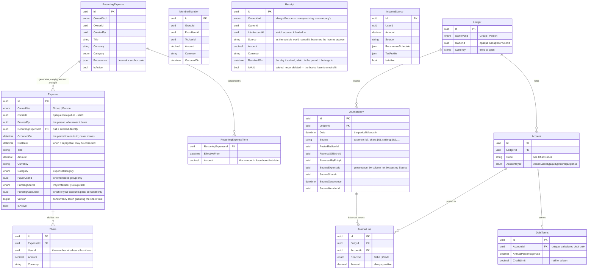

# Domain Model — Finance

> **Boundary:** finance never resolves a group to anything. Everything group-scoped is keyed by an
> **opaque `GroupId`** (and members by opaque `UserId`); there is no group or membership
> entity here. The double-entry **ledger is the single source of truth** for who-owes-whom and
> settled-state — `Expense`/`Share` are *source documents* that drive journal entries, and a
> settlement lives only as a `JournalEntry` (there is no `Reimbursement` table).

## ERD

> Regenerate this when the model moves. It described `Charge`, `Allocation`, `ChargePayment` and a
> `PayerMembershipId` for some time after all four were gone, which is worse than having no ERD:
> a document that claims to settle arguments and is wrong will settle them wrongly.

```mermaid
erDiagram
    Expense {
        uuid Id PK
        enum OwnerKind "Group | Person"
        uuid OwnerId "opaque GroupId or UserId"
        uuid EnteredBy "the person who wrote it down"
        uuid RecurringExpenseId FK "null = entered directly"
        datetime OccurredOn "the period it reports in; never moves"
        datetime DueDate "when it is payable; may be corrected"
        string Title
        decimal Amount
        string Currency
        enum Category "ExpenseCategory"
        uuid PayerUserId "who fronted it; group only"
        enum FundingSource "PayerMember | GroupCash"
        uuid FundingAccountId "which of your accounts paid; personal only"
        bigint Version "concurrency token guarding the share total"
        bool IsActive
    }
    Share {
        uuid Id PK
        uuid ExpenseId FK
        uuid UserId "the member who bears this share"
        decimal Amount
        string Currency
    }
    RecurringExpense {
        uuid Id PK
        enum OwnerKind
        uuid OwnerId
        uuid CreatedBy
        string Title
        string Currency
        enum Category
        json Recurrence "interval + anchor date"
        bool IsActive
    }
    RecurringExpenseTerm {
        uuid RecurringExpenseId FK
        datetime EffectiveFrom
        decimal Amount "the amount in force from that date"
    }
    MemberTransfer {
        uuid Id PK
        uuid GroupId
        uuid FromUserId
        uuid ToUserId
        decimal Amount
        string Currency
        datetime OccurredOn
    }
    Receipt {
        uuid Id PK
        enum OwnerKind "always Person — money arriving is somebody's"
        uuid OwnerId
        uuid IntoAccountId "which account it landed in"
        string Source "as the outside world named it; becomes the income account"
        decimal Amount
        string Currency
        datetime ReceivedOn "the day it arrived, which is the period it belongs to"
        bool IsVoid "voided, never deleted — the books have to unwind it"
    }
    IncomeSource {
        uuid Id PK
        uuid UserId
        decimal Amount
        string Source
        json RecurrenceSchedule
        json TaxProfile
        bool IsActive
    }
    Ledger {
        uuid Id PK
        enum OwnerKind "Group | Person"
        uuid OwnerId "opaque GroupId or UserId"
        string Currency "fixed at open"
    }
    Account {
        uuid Id PK
        uuid LedgerId FK
        string Code "see ChartCodes"
        enum AccountType "Asset|Liability|Equity|Income|Expense"
    }
    JournalEntry {
        uuid Id PK
        uuid LedgerId FK
        datetime Date "the period it lands in"
        string Source "expense:{id}, share:{id}, settleup:{id}, ..."
        uuid PostedByUserId
        uuid ReversalOfEntryId
        uuid ReversedByEntryId
        uuid SourceExpenseId "provenance, by column not by parsing Source"
        uuid SourceShareId
        datetime SourceOccurrence
        uuid SourceMemberId
    }
    JournalLine {
        uuid Id PK
        uuid EntryId FK
        uuid AccountId FK
        enum Direction "Debit | Credit"
        decimal Amount "always positive"
    }
    DebtTerms {
        uuid Id PK
        uuid AccountId FK "unique; a declared debt only"
        decimal AnnualPercentageRate
        decimal CreditLimit "null for a loan"
    }

    RecurringExpense ||--o{ RecurringExpenseTerm : "versioned by"
    RecurringExpense ||--o{ Expense : "generates, copying amount and split"
    Expense ||--o{ Share : "divides into"
    Ledger ||--o{ Account : holds
    Ledger ||--o{ JournalEntry : records
    JournalEntry ||--|{ JournalLine : "balances across"
    Account ||--o{ JournalLine : "posted to"
    Account ||--o| DebtTerms : "carries"
```

**Not in the ERD, deliberately:** any balance, any `IsPaid`. Both are folds over `JournalLine`;
storing either is how a derived total drifts from the entries it came from. `FinancialConnection`
and its mirrored accounts/transactions are also absent — they are a cache of Plaid's data, not
part of this model; see `docs/use-cases/plaid-integration.md`.

## How source documents drive the ledger

Each row is one method on `Domain/Engines/Journalize.cs`, which is where the direction of every
entry is named once. Every source key is built by `Domain/Engines/LedgerSources.cs` — all six of
them, in one place, so a reversal can always find what it is reversing.

| Business event | Journal entry | Source |
|---|---|---|
| **Expense incurred** (`ExpenseIncurred`) | Dr `Expense:{cat}` / Cr `Vendor Payable` | `expense:{id}` · `SourceExpenseId` |
| **A member takes their share** (`ShareBorne`) | Dr `Member:{member}` / Cr `Expense:{cat}` | `share:{shareId}` · `SourceExpenseId`+`SourceMemberId` |
| **Vendor paid** (`VendorPaid`) | Dr `Vendor Payable` / Cr `FundingAccount` | `vendorpayment:{expenseId}:{occ}` · `SourceExpenseId`+`SourceOccurrence` |
| **Member settles their share** (`Settlement`) | Dr `FundingAccount` / Cr `Member:{debtor}` | `settlement:{expenseId}:{occ}:{fromUserId}` · `SourceExpenseId`+`SourceShareId`+`SourceOccurrence`+`SourceMemberId` |
| **Two members square up directly** (`SettleUp`) | Dr `Member:{creditor}` / Cr `Member:{debtor}` | `settleup:{transferId}` · `SourceMemberId` |
| **Money arrives** (`Received`) | Dr `{account it landed in}` / Cr `Income:{source}` | `receipt:{id}` |
| **Un-mark paid** | reversing entry (mirror Dr/Cr), references the original | same source; `ReversalOfEntryId` set |

*Settled-per-(share, occurrence)* is the **signed sum** of settlement entries (a reversal
negates its original) — see `Infrastructure/Queries/SettlementReads.cs`. The contributions and
member-balance reads derive `isPaid`/balances from this, not from any stored flag.

`FundingAccount` is *not a type* — it's the role an ordinary account plays as the one that paid
the vendor: `Member:{payer}` (one-payer) or `Cash` (a shared pool). The engine books both
identically. Which account it resolves to is the expense's per-expense **`FundingSource`**
(`PayerMember` → the payer's `Member` account; `GroupCash` → `Cash`) — settlements and vendor
payments both mirror their expense's funding.

## Posting is event-driven (outbox → consumer), never coordinated by a controller

Controllers and managers **never call bookkeeping directly** (the one exception is the
member-to-member settle-up transfer). Every mutation commits its aggregate change **and the domain
events it raised** in one transaction (the outbox). `LedgerJournalConsumer` then consumes those
events off RabbitMQ and brings the books in step — so an expense/share/settlement row can never
be durably saved without its ledger posting eventually following.

- **Convergent, not trusting:** each handler re-reads the current aggregate and asks
  `BookkeepingManager` to *sync* the books to it — posting when missing, reverse-and-repost when
  stale, no-op when already matching. This makes redeliveries idempotent and out-of-order events
  safe (a stale update arriving after a newer one still lands on the latest state).
- **Serialized:** the consumer runs one message at a time (`ConcurrentMessageLimit = 1`), so a
  reverse-then-repost can never interleave with another event into a duplicate or missing posting.
  A partial unique index on `journal_entries (ledger_id, source)` (active entries only — see the
  `JournalEntry` row below) is the DB-level backstop; a unique violation is treated as
  already-posted.
- **Reads lag ~1–2s:** the outbox polls every ~1s, so ledger-derived reads (`/balances`,
  contributions `isPaid`) trail a mutation briefly. Don't "fix" a stale-read symptom by re-adding
  a synchronous ledger write — patch the read optimistically client-side instead.

## Aggregates & invariants

| Aggregate | Key invariants (where enforced) |
|---|---|
| **Expense** | Title non-empty; Amount ≥ 0 (`Expense.Create`/`Update`); cannot deactivate twice (`Expense.Deactivate`); a person can only enter an expense into their own book; `OccurredOn` never moves once set |
| **Share** | Amount ≥ 0 (`Share.Create`/`Update`); one share per member per expense; a share refuses an expense it is not on; a personal expense has no shares; **Σ shares ≤ expense total** — checked in `ExpenseManager` against `ShareMath`, serialised by `Expense.Version` because shares are their own rows |
| **RecurringExpense** | Title non-empty; Amount ≥ 0; nobody opens an agreement in somebody else's own book (`RecurringExpense.Create`); amending is a new `RecurringExpenseTerm` from a date, never an edit — re-amending the same date replaces that version rather than stacking a second (`Amend`); only whoever opened it may amend or stop it (`IsManagedBy`) |
| **MemberTransfer** | Nobody settles up with themselves; amount > 0 (`MemberTransfer.Record`); keyed on its own id, so two settle-ups between the same pair are two facts |
| **Receipt** | Source non-empty; Amount > 0 — nothing or less did not arrive (`Receipt.Record`); always a person's own book; voided, never deleted, so the books can unwind what they were told (`Void`) |
| **DebtTerms** | One set per account, and only on a declared debt — a rate on a cash account is meaningless rather than merely odd (`DebtTerms.For`) |
| **IncomeSource** | Source non-empty; Amount ≥ 0; `TryDeactivate` idempotent, `Deactivate` throws if inactive |
| **Ledger** | Single currency (P10) |
| **Account** | Typed; `NormalBalance` derived from `AccountType`; balances never stored (derived from journal lines) |
| **JournalEntry** | ≥ 2 journal lines, all positive, single currency, **Σ debits == Σ credits** (P2, `JournalEntry.Post`); append-only — corrections are `Reverse` entries (P4). An entry is *active* iff it is neither a reversal (`ReversalOfEntryId`) nor itself reversed (`ReversedByEntryId`, set on the original by `Reverse`); a partial unique index on `(ledger_id, source)` over active rows forbids a duplicate active entry |

## Value objects

| Type | Description |
|---|---|
| `Money` | Amount + currency. **Signed** (contra/reversing entries, card balances go negative); non-negativity is a per-aggregate invariant, not intrinsic |
| `RecurrenceSchedule` | Frequency + start + optional end |
| `ExpenseCategory` | Enum of expense categories; `ExpenseCategories.Parse` is the one reader, and it refuses an unknown rather than filing it under Other |
| `RecurrenceFrequency` | `Daily`, `Weekly`, `Monthly`, `Yearly` |
| `AccountingEntity` | Whose books something belongs to: an `EntityKind` (`Group`/`Person`) plus an opaque id. Replaced the nullable-`GroupId`-as-discriminator pairs |
| `FundingSource` | `PayerMember` (one member fronted it) or `GroupCash` (paid from the pot) |
| `RecurringExpenseTerm` | One amount and the date it took effect — a schedule is a list of these |
| `LedgerId`/`AccountId`/`JournalEntryId`/`JournalLineId`/`ExpenseId`/`ShareId`/`RecurringExpenseId`/`MemberTransferId`/`ReceiptId`/`IncomeId`/`FinancialConnectionId` | Strongly-typed ids |
| `AccountType` · `NormalBalance` · `EntryDirection` | Ledger enums |

## Domain events

`Infrastructure/Messaging/PublishedEvents.cs` is the one list of events that reach the bus; the
rest are in-process only. Keep this table and that list in step.

| Event | Raised by | On the bus? |
|---|---|---|
| `ExpenseCreated` / `ExpenseUpdated` / `ExpenseDeactivated` / `ExpenseActivated` | `Expense.*` | yes — group and notifications consume these |
| `ExpensePaid` / `ExpenseUnpaid` | `Expense.RecordPersonalPayment` / `ReversePersonalPayment` | yes — a **personal** expense being paid, not a group share |
| `VendorPaid` / `VendorPaymentReversed` | `Expense.RecordVendorPayment` / `ReverseVendorPayment` | yes |
| `ShareCreated` / `ShareUpdated` / `ShareRemoved` | `Share.*` | yes |
| `SettlementRecorded` / `SettlementReversed` | `Share.Settle` / `Share.ReverseSettlement` | yes — group activity feed consumes `SettlementRecorded` |
| `MemberTransferRecorded` | `MemberTransfer.Record` | yes — drives the settle-up posting |
| `ReceiptRecorded` / `ReceiptVoided` | `Receipt.*` | yes |
| `RecurringExpenseCreated` / `Amended` / `Deactivated` | `RecurringExpense.*` | no |
| `IncomeSourceCreated` / `Updated` / `Activated` / `Deactivated` / `TaxProfileSet` / `DeductionAdded` / `DeductionRemoved` | `IncomeSource.*` | no |
| `LedgerOpened` / `AccountOpened` / `JournalEntryPosted` / `JournalEntryReversed` | `Ledger.*` / `JournalEntry.Post` / `Reverse` | no — ledger housekeeping, deliberately not outboxed |
| `FinancialConnectionEstablished` / `RequiresReauth` / `Revoked` / `Healthy` / `Synced` | `FinancialConnection.*` | no |

> Cross-service events: finance publishes domain events directly (no integration-event mapping
> layer); consumers declare matching record types in the `Finance.Domain.Events` namespace.
