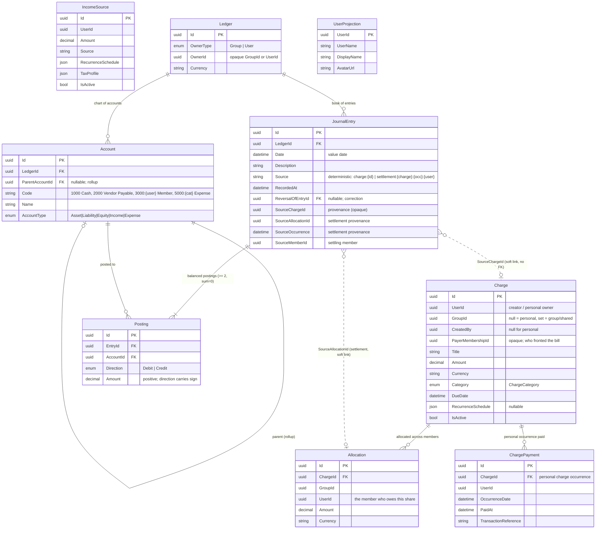

# Domain Model — Finance

> **Boundary:** finance knows nothing of "household". Everything group-scoped is keyed by an
> **opaque `GroupId`** (and members by opaque `UserId`); there is no `Household`/`Membership`
> entity here. The double-entry **ledger is the single source of truth** for who-owes-whom and
> settled-state — `Charge`/`Allocation` are *source documents* that drive journal entries, and a
> settlement lives only as a `JournalEntry` (there is no `Reimbursement` table).

## ERD

```mermaid
erDiagram
    Charge {
        uuid Id PK
        uuid UserId "creator / personal owner"
        uuid GroupId "null = personal, set = group/shared"
        uuid CreatedBy "null for personal"
        uuid PayerMembershipId "opaque; who fronted the bill"
        string Title
        decimal Amount
        string Currency
        enum Category "ChargeCategory"
        datetime DueDate
        json RecurrenceSchedule "nullable"
        bool IsActive
    }
    Allocation {
        uuid Id PK
        uuid ChargeId FK
        uuid GroupId
        uuid UserId "the member who owes this share"
        decimal Amount
        string Currency
    }
    ChargePayment {
        uuid Id PK
        uuid ChargeId FK "personal charge occurrence"
        uuid UserId
        datetime OccurrenceDate
        datetime PaidAt
        string TransactionReference
    }
    IncomeSource {
        uuid Id PK
        uuid UserId
        decimal Amount
        string Source
        json RecurrenceSchedule
        json TaxProfile
        bool IsActive
    }
    Ledger {
        uuid Id PK
        enum OwnerType "Group | User"
        uuid OwnerId "opaque GroupId or UserId"
        string Currency
    }
    Account {
        uuid Id PK
        uuid LedgerId FK
        uuid ParentAccountId FK "nullable; rollup"
        string Code "1000 Cash, 2000 Vendor Payable, 3000:{user} Member, 5000:{cat} Expense"
        string Name
        enum AccountType "Asset|Liability|Equity|Income|Expense"
    }
    JournalEntry {
        uuid Id PK
        uuid LedgerId FK
        datetime Date "value date"
        string Description
        string Source "deterministic: charge:{id} | settlement:{charge}:{occ}:{user}"
        datetime RecordedAt
        uuid ReversalOfEntryId FK "nullable; correction"
        uuid SourceChargeId "provenance (opaque)"
        uuid SourceAllocationId "settlement provenance"
        datetime SourceOccurrence "settlement provenance"
        uuid SourceMemberId "settling member"
    }
    Posting {
        uuid Id PK
        uuid EntryId FK
        uuid AccountId FK
        enum Direction "Debit | Credit"
        decimal Amount "positive; direction carries sign"
    }
    UserProjection {
        uuid UserId PK
        string UserName
        string DisplayName
        string AvatarUrl
    }

    Charge        ||--o{ Allocation    : "allocated across members"
    Charge        ||--o{ ChargePayment : "personal occurrence paid"
    Ledger        ||--o{ Account       : "chart of accounts"
    Ledger        ||--o{ JournalEntry  : "book of entries"
    Account       ||--o| Account       : "parent (rollup)"
    JournalEntry  ||--|{ Posting       : "balanced postings (>= 2, sum=0)"
    Account       ||--o{ Posting       : "posted to"
    JournalEntry  }o..o| Charge        : "SourceChargeId (soft link, no FK)"
    JournalEntry  }o..o| Allocation    : "SourceAllocationId (settlement, soft link)"
```

**Soft links (no DB FK)** are the dotted relationships: a `JournalEntry` carries opaque
`Source*` provenance columns pointing back at the `Charge`/`Allocation`/member that originated
it. This is how the ledger stays generic (it knows nothing of charges) while read models still
attribute a journal entry to its occurrence — replacing the deleted `Reimbursement` table.

## How source documents drive the ledger

| Business event | Journal entry(ies) | Source |
|---|---|---|
| **Group charge created** (payer fronts, members allocated) | ① Dr `Expense:{cat}` / Cr `FundingAccount` (incurred)  ② Dr `Member:{each}` (+ funder remainder) / Cr `Expense:{cat}` (allocated) | `charge:{id}` · `SourceChargeId` |
| **Member settles their share** | Dr `FundingAccount` / Cr `Member:{debtor}` (a balanced **Transfer**) | `settlement:{charge}:{occ}:{user}` · `SourceChargeId`+`SourceAllocationId`+`SourceOccurrence`+`SourceMemberId` |
| **Un-mark paid** | reversing entry (mirror Dr/Cr), references the original | same source; `ReversalOfEntryId` set |

*Settled-per-(allocation, occurrence)* is the **signed sum** of settlement postings (a reversal
negates its original) — see `Infrastructure/Queries/SettlementReads.cs`. The contributions and
member-balance reads derive `isPaid`/balances from this, not from any stored flag.

`FundingAccount` is *not a type* — it's the role an ordinary account plays as the one that paid
the vendor: `Member:{payer}` (one-payer) or `Cash` (a shared pool). The engine books both
identically. Which account it resolves to is the charge's per-charge **`FundingSource`**
(`PayerMember` → the payer's `Member` account; `GroupCash` → `Cash`) — settlements and vendor
payments both mirror their charge's funding.

## Posting is event-driven (outbox → consumer), never coordinated by a controller

Controllers and managers **never call bookkeeping directly** (the one exception is the
member-to-member settle-up transfer). Every mutation commits its aggregate change **and the domain
events it raised** in one transaction (the outbox). `LedgerPostingConsumer` then consumes those
events off RabbitMQ and brings the books in step — so a charge/allocation/settlement row can never
be durably saved without its ledger posting eventually following.

- **Convergent, not trusting:** each handler re-reads the current aggregate and asks
  `BookkeepingManager` to *sync* the books to it — posting when missing, reverse-and-repost when
  stale, no-op when already matching. This makes redeliveries idempotent and out-of-order events
  safe (a stale update arriving after a newer one still lands on the latest state).
- **Serialized:** the consumer runs one message at a time (`ConcurrentMessageLimit = 1`), so a
  reverse-then-repost can never interleave with another event into a duplicate or missing posting.
  A partial unique index on `journal_entries (ledger_id, source)` (active entries only — see the
  `JournalEntry` row below) is the DB-level backstop; a unique violation is treated as
  already-posted.
- **Reads lag ~1–2s:** the outbox polls every ~1s, so ledger-derived reads (`/balances`,
  contributions `isPaid`) trail a mutation briefly. Don't "fix" a stale-read symptom by re-adding
  a synchronous ledger write — patch the read optimistically client-side instead.

## Aggregates & invariants

| Aggregate | Key invariants (where enforced) |
|---|---|
| **Charge** | Title non-empty; Amount ≥ 0 (`Charge.Create`/`Update`); cannot deactivate twice (`Charge.Deactivate`) |
| **Allocation** | Amount ≥ 0 (`Allocation.Create`/`Update`); one allocation per member per charge; **Σ active allocations ≤ charge total** (`ChargeManager`, all write paths — even-split rounding absorbs the remainder into the last share, `AllocationMath`) |
| **ChargePayment** | At most one payment per (ChargeId, OccurrenceDate) (`ChargeManager.MarkPaidAsync`, personal path) |
| **IncomeSource** | Source non-empty; Amount ≥ 0; `TryDeactivate` idempotent, `Deactivate` throws if inactive |
| **Ledger** | Single currency (P10) |
| **Account** | Typed; `NormalBalance` derived from `AccountType`; balances never stored (derived from postings) |
| **JournalEntry** | ≥ 2 postings, all positive, single currency, **Σ debits == Σ credits** (P2, `JournalEntry.Post`); append-only — corrections are `Reverse` entries (P4). An entry is *active* iff it is neither a reversal (`ReversalOfEntryId`) nor itself reversed (`ReversedByEntryId`, set on the original by `Reverse`); a partial unique index on `(ledger_id, source)` over active rows forbids a duplicate active posting |

## Value objects

| Type | Description |
|---|---|
| `Money` | Amount + currency. **Signed** (contra/reversing entries, card balances go negative); non-negativity is a per-aggregate invariant, not intrinsic |
| `RecurrenceSchedule` | Frequency + start + optional end |
| `ChargeCategory` | Enum of charge categories |
| `RecurrenceFrequency` | `Daily`, `Weekly`, `Monthly`, `Yearly` |
| `LedgerId`/`AccountId`/`JournalEntryId`/`PostingId`/`ChargeId`/`AllocationId` | Strongly-typed ids |
| `AccountType` · `NormalBalance` · `EntryDirection` · `LedgerOwnerType` | Ledger enums |

## Domain events

| Event | Raised by | Notes |
|---|---|---|
| `ChargeCreated` / `ChargeUpdated` / `ChargeDeactivated` / `ChargeActivated` | `Charge.*` | household consumes `ChargeCreated` |
| `AllocationCreated` / `AllocationUpdated` / `AllocationRemoved` | `Allocation.*` | |
| `SettlementRecorded` / `SettlementReversed` | the settlement `JournalEntry` (attached by `BookkeepingManager`) | household activity feed consumes `SettlementRecorded`; drained to outbox via `SaveChangesAsync` |
| `JournalEntryPosted` / `JournalEntryReversed` | `JournalEntry.Post` / `Reverse` | ledger-internal |
| `IncomeSourceCreated` / `Updated` / `Deactivated` | `IncomeSource.*` | |

> Cross-service events: finance publishes domain events directly (no integration-event mapping
> layer); consumers declare matching record types in the `Finance.Domain.Events` namespace.
