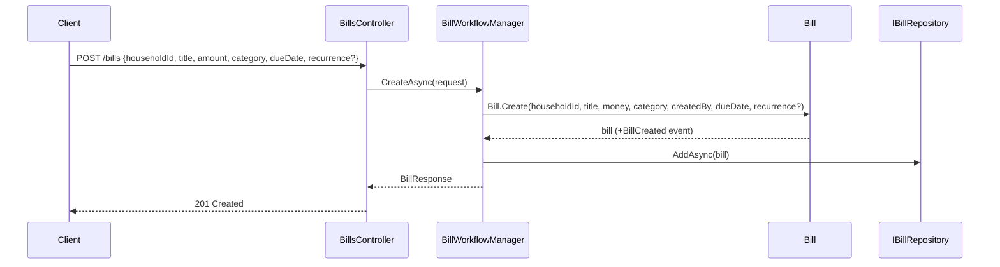
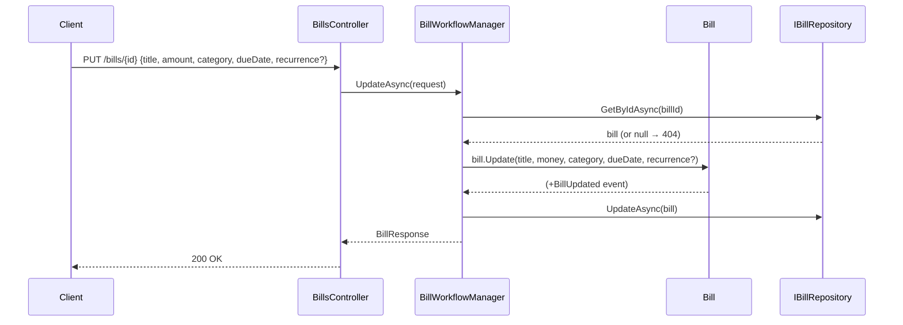
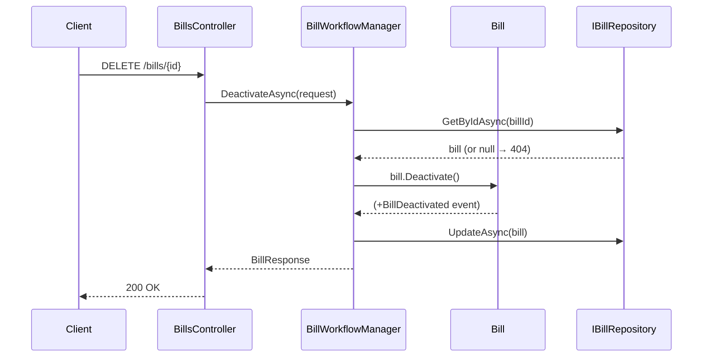

# Use Case: Bill Lifecycle

**Manager:** `BillWorkflowManager`

---

## Create Bill

**Entry point:** `POST /bills`

---

## Update Bill

**Entry point:** `PUT /bills/{id}`

---

## Deactivate Bill

**Entry point:** `DELETE /bills/{id}`

## Guard failures

| Guard | Error |
|---|---|
| Title empty | `ArgumentException` |
| Amount negative | `ArgumentException` |
| Due date in the past (create only) | `ArgumentException` |
| Bill already inactive | `InvalidOperationException` |
