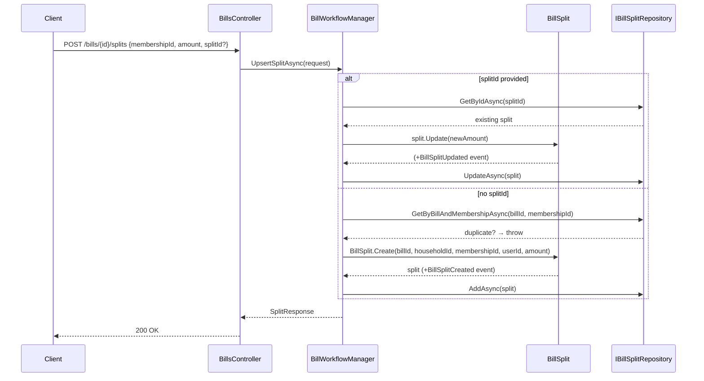
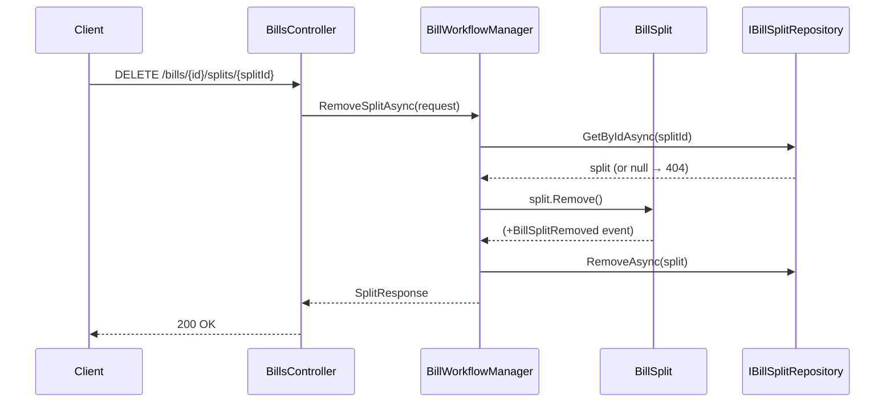

# Use Case: Bill Splits

**Manager:** `BillWorkflowManager`

A split represents one member's share of a bill. Each member can have at most one split per bill.

---

## Upsert Split

**Entry point:** `POST /bills/{id}/splits`  
Creates a new split, or updates an existing one if `splitId` is provided.

---

## Remove Split

**Entry point:** `DELETE /bills/{id}/splits/{splitId}`

## Guard failures

| Guard | Error |
|---|---|
| Duplicate split for same member+bill | `InvalidOperationException` |
| Amount negative | `ArgumentException` |
| Claiming already claimed split | `InvalidOperationException` |
