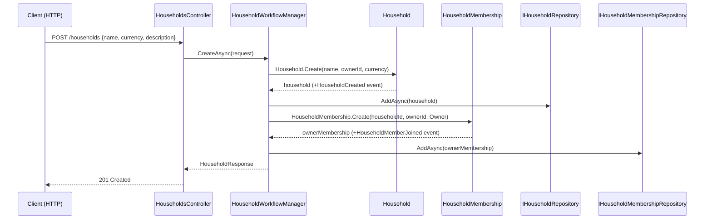

# Use Case: Create Household

**Actor:** Authenticated user  
**Entry point:** `POST /households`  
**Manager:** `HouseholdWorkflowManager.CreateAsync`

## Flow

## Notes

- Creating a household atomically creates the owner's `HouseholdMembership` with `Role = Owner`.
- The household and membership are saved in separate repository calls (no transaction scope — eventual consistency via outbox).
