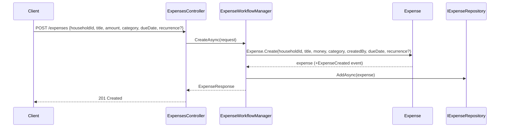
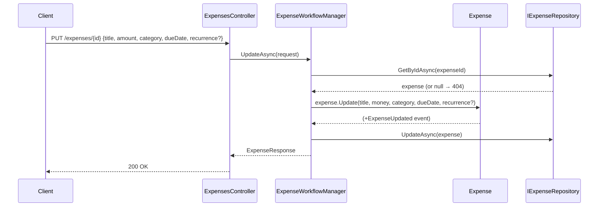
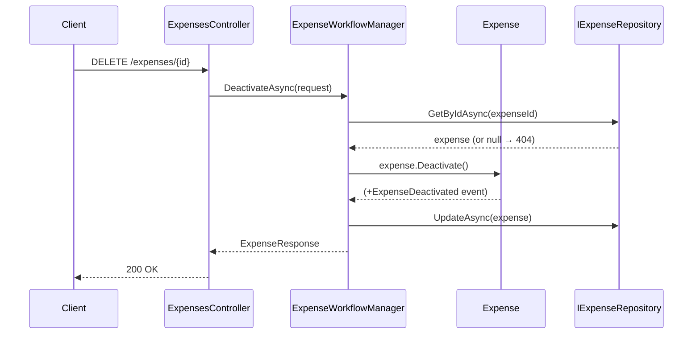

# Use Case: Expense Lifecycle

**Manager:** `ExpenseWorkflowManager`

---

## Create Expense

**Entry point:** `POST /expenses`

---

## Update Expense

**Entry point:** `PUT /expenses/{id}`

---

## Deactivate Expense

**Entry point:** `DELETE /expenses/{id}`

## Guard failures

| Guard | Error |
|---|---|
| Title empty | `ArgumentException` |
| Amount negative | `ArgumentException` |
| Due date in the past (create only) | `ArgumentException` |
| Expense already inactive | `InvalidOperationException` |
