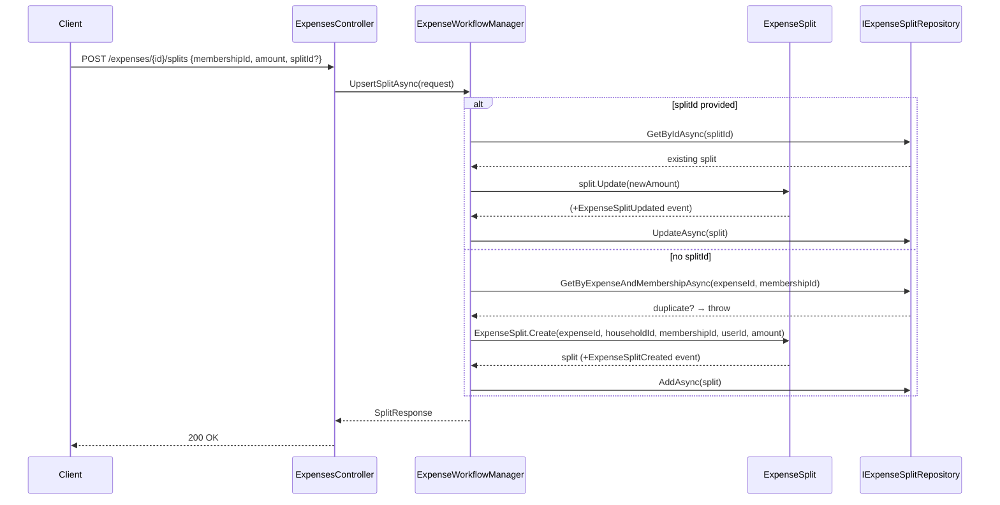
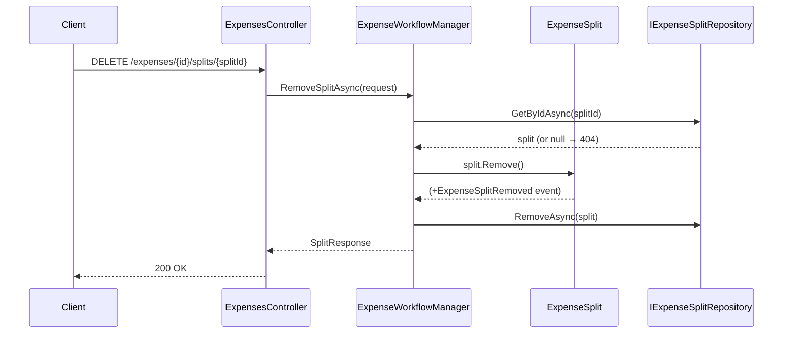

# Use Case: Expense Splits

**Manager:** `ExpenseWorkflowManager`

A split represents one member's share of an expense. Each member can have at most one split per expense.

---

## Upsert Split

**Entry point:** `POST /expenses/{id}/splits`  
Creates a new split, or updates an existing one if `splitId` is provided.

---

## Remove Split

**Entry point:** `DELETE /expenses/{id}/splits/{splitId}`

## Guard failures

| Guard | Error |
|---|---|
| Duplicate split for same member+expense | `InvalidOperationException` |
| Amount negative | `ArgumentException` |
| Claiming already claimed split | `InvalidOperationException` |
