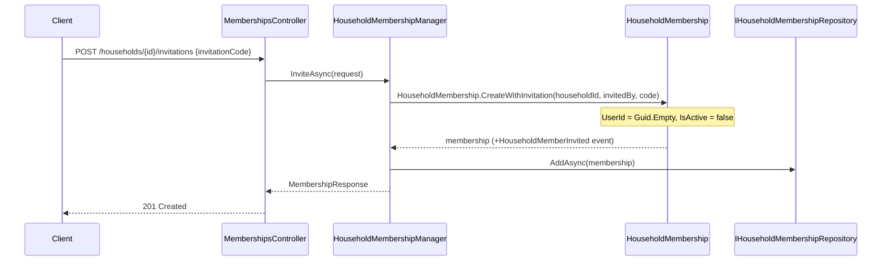
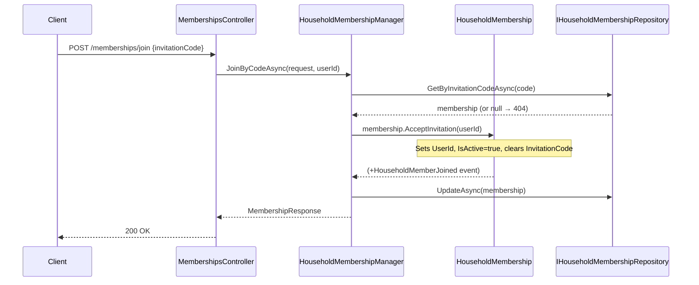
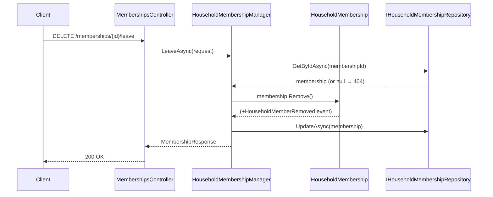

# Use Case: Household Membership

**Manager:** `HouseholdMembershipManager`

---

## Invite Member

**Entry point:** `POST /households/{id}/invitations`  
Creates a pending membership with an invitation code. The invited user is not yet known.

---

## Join by Invitation Code

**Entry point:** `POST /memberships/join`

---

## Leave Household

**Entry point:** `DELETE /memberships/{id}/leave`

---

## Change Role / Remove Member

Both follow the same pattern as Leave: `GetByIdAsync` → domain method → `UpdateAsync`.

| Operation | Entry point | Domain method |
|---|---|---|
| Change role | `PUT /memberships/{id}/role` | `membership.ChangeRole(newRole)` |
| Remove member | `DELETE /memberships/{id}` | `membership.Remove()` |

## Guard failures

| Guard | Error |
|---|---|
| New role equals current role | `InvalidOperationException` |
| Membership already inactive | `InvalidOperationException` |
| Invitation code not found | Returns `null` (404) |
| AcceptInvitation on active membership | `InvalidOperationException` |
| AcceptInvitation without invitation code | `InvalidOperationException` |
