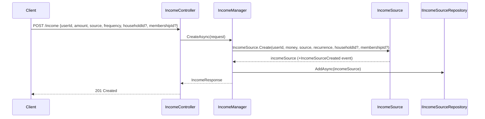
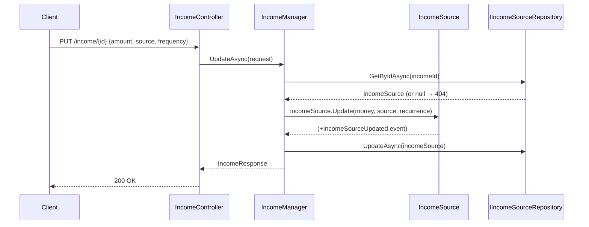
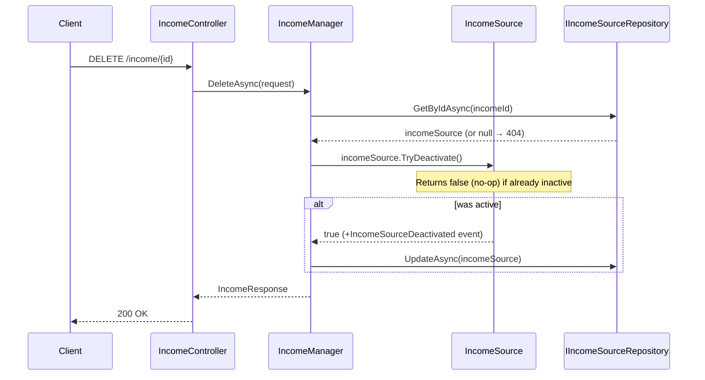

# Use Case: Income Sources

**Manager:** `IncomeManager`

Income sources track a user's recurring income, optionally linked to a household membership for coverage analysis.

---

## Create Income Source

**Entry point:** `POST /income`

---

## Update Income Source

**Entry point:** `PUT /income/{id}`

---

## Delete Income Source

**Entry point:** `DELETE /income/{id}`

Uses `TryDeactivate` — idempotent, no error if already inactive.

## Guard failures

| Guard | Error |
|---|---|
| Source label empty | `ArgumentException` |
| Amount negative | `ArgumentException` |
| `Deactivate` on already inactive | `InvalidOperationException` |
| `TryDeactivate` on already inactive | No-op, returns `false` |
