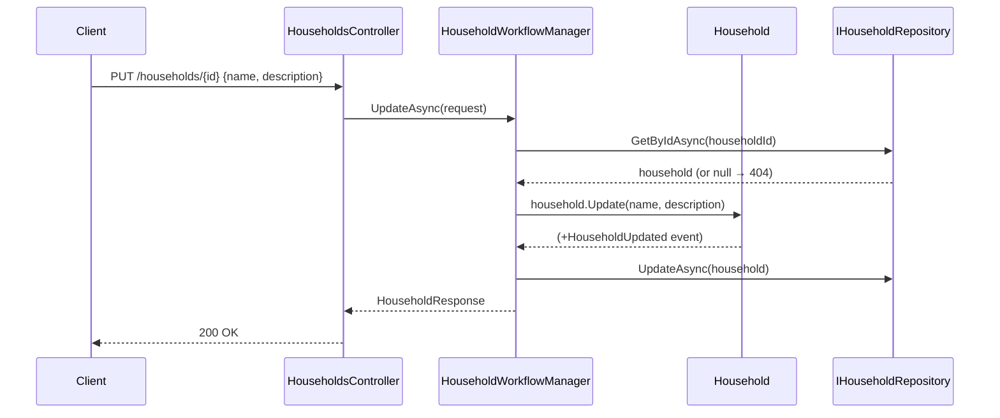
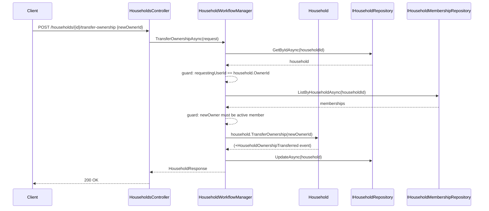
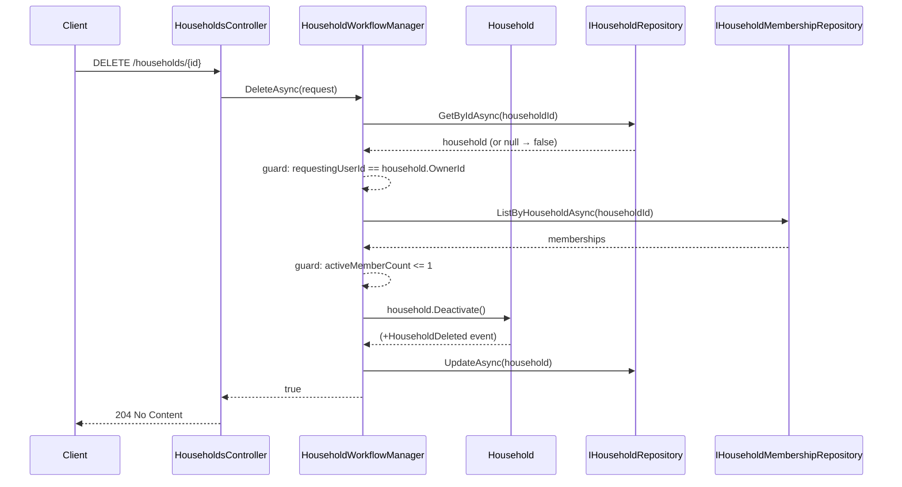

# Use Case: Manage Household

Covers update, ownership transfer, and deletion.

**Actor:** Household owner  
**Manager:** `HouseholdWorkflowManager`

---

## Update Household

**Entry point:** `PUT /households/{id}`

---

## Transfer Ownership

**Entry point:** `POST /households/{id}/transfer-ownership`

---

## Delete Household

**Entry point:** `DELETE /households/{id}`

## Guard failures

| Guard | Error |
|---|---|
| Requester is not owner (transfer/delete) | `UnauthorizedAccessException` |
| New owner not an active member | `InvalidOperationException` |
| Deleting with >1 active member | `InvalidOperationException` |
