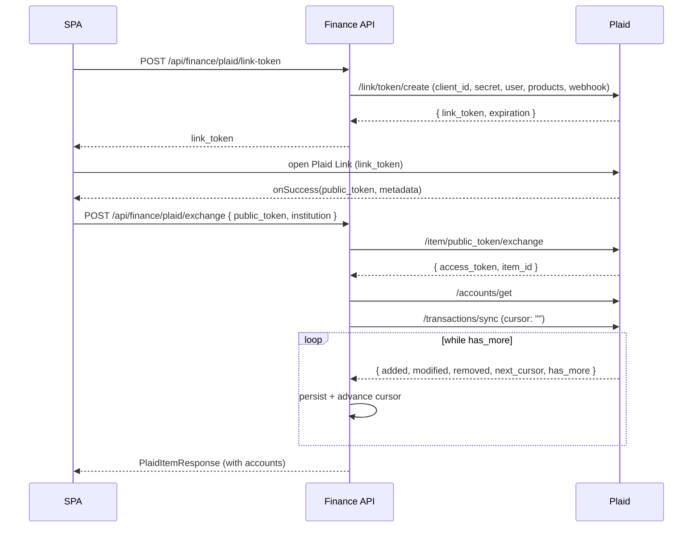
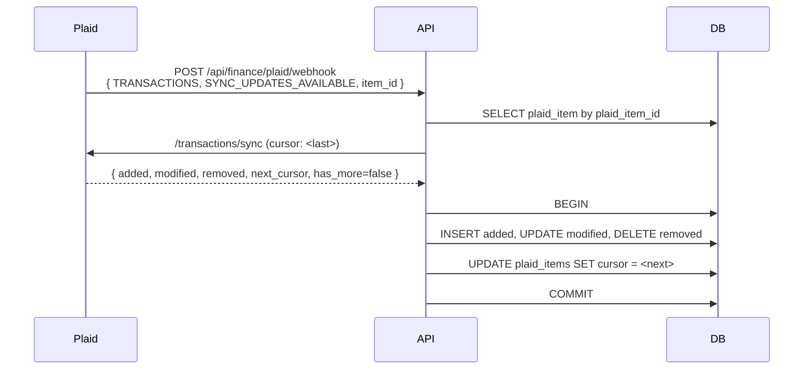

# Use case — Plaid bank linking & automatic transaction sync

## Goal

Let a user connect their bank accounts via Plaid Link and have the system:

1. Continuously pull transactions in the background.
2. Detect recurring deposits and bills automatically.
3. Promote those into tracked `IncomeSource` / `Expense` entities on demand.

## Performance contract

| Concern | Mitigation |
|---|---|
| Avoid re-pulling known transactions | `/transactions/sync` is **cursor-based**. The cursor is persisted on `PlaidItem.Cursor` and advanced inside the same DB commit as the row writes. A first sync is the only "full" pull; every subsequent sync returns only added/modified/removed deltas since the last cursor. |
| Avoid polling | Plaid pushes a `TRANSACTIONS / SYNC_UPDATES_AVAILABLE` webhook every time it has new data. The webhook handler runs the same cursor-sync used by the manual flow. |
| Concurrent webhook + manual sync | A unique index on `plaid_transactions.plaid_transaction_id` plus a single-cursor-per-item invariant make collisions a no-op: the loser of the race finds nothing new on its next iteration. |
| Recurrence inference cost | We delegate to Plaid's `/transactions/recurring/get` (server-side ML across cross-institution data). The result set is upserted by stable `stream_id` so re-running detection is cheap and idempotent. |
| Access-token security | Plaid `access_token` values are encrypted at rest with ASP.NET Data Protection (`AccessTokenProtector`, named purpose `Finance.Plaid.AccessToken.v1`). The plaintext token is reconstructed only inside the manager during sync. |

## Sequence — initial link



## Sequence — incremental update via webhook



## Endpoints

| Method | Path | Purpose |
|---|---|---|
| POST | `/api/finance/plaid/link-token` | Mint a single-use Plaid Link token for the SPA. |
| POST | `/api/finance/plaid/exchange` | Exchange the `public_token` for the long-lived `access_token` and persist the linked item. |
| GET  | `/api/finance/plaid/items` | List linked institutions for the current user. |
| POST | `/api/finance/plaid/items/{id}/sync` | Manual cursor-based sync. |
| GET  | `/api/finance/plaid/items/{id}/transactions` | Paginated transactions. |
| POST | `/api/finance/plaid/items/{id}/recurring/refresh` | Re-run Plaid recurring detection. |
| GET  | `/api/finance/plaid/recurring` | List detected recurring streams. |
| POST | `/api/finance/plaid/recurring/{id}/accept` | Promote a stream to an `IncomeSource` (inflow) or `Expense` (outflow). |
| DELETE | `/api/finance/plaid/items/{id}` | Unlink an institution (best-effort `/item/remove` + local purge). |
| POST | `/api/finance/plaid/webhook` | Plaid webhook receiver (anonymous; gated on item-id existence). |

## Idempotency keys

| Aggregate | Key | Constraint |
|---|---|---|
| `PlaidItem` | `plaid_item_id` | UNIQUE — re-link replaces the access token in place. |
| `PlaidAccount` | `(plaid_item_id, plaid_account_id)` | UNIQUE per item. |
| `PlaidTransaction` | `plaid_transaction_id` | UNIQUE — the sync dedup key. |
| `RecurringStream` | `plaid_stream_id` | UNIQUE — used for upsert during refresh. |
| Promote stream | `stream_id` + `IsLinked` flag | Re-accepting returns the existing linked entity. |

## Configuration

```jsonc
// appsettings.json
"Plaid": {
  "ClientId": "",          // from Plaid dashboard
  "Secret": "",            // sandbox/development/production secret
  "Environment": "sandbox", // sandbox | development | production
  "CountryCodes": [ "US" ],
  "Products": [ "transactions" ],
  "AppName": "Portfolio Finance",
  "Language": "en",
  "WebhookUrl": "https://<public-host>/api/finance/plaid/webhook"
}
```

The webhook URL must be HTTPS-reachable from Plaid's servers. In local dev, expose
the Finance API via `ngrok` or `cloudflared` and point `WebhookUrl` at the tunnel.

## Production hardening checklist

- [ ] Validate the `Plaid-Verification` JWT on the webhook endpoint against Plaid's JWKS. The current implementation accepts unsigned posts (gated on item-id existence); fine for staging, not for prod.
- [ ] Persist Data Protection keys in a durable store (Azure Key Vault / file share) — the default in-memory key ring means encrypted access tokens become unreadable across deployments.
- [ ] Add a Hangfire / Quartz background job that re-syncs every healthy item every 6h as a safety net for missed webhooks.
- [ ] Rate-limit the manual sync endpoint per user (currently unbounded).
- [ ] Surface `PlaidItemLoginRequired` events in the notifications service so the user is prompted to re-authenticate via Plaid Link's update mode.
